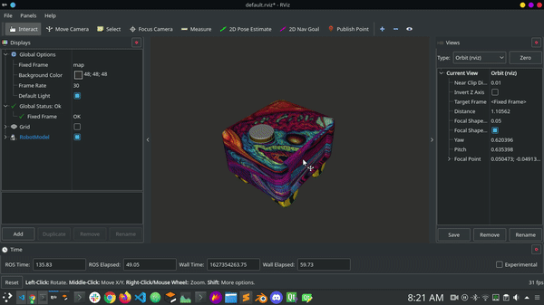

# curdbot_outdoor
The repo beholds the packages for outdoor navigation of a mobile robot using gps for localization.

# Goals :
1. Localize bot via GPS, Wheel Odom and IMU
2. Implement movebase for cmd_vel publisher and dynamic obstracle detection.


# Clone repo instructions
```sh
git clone https://github.com/shivam675/curdbot_outdoor.git
```

## OUTPUT DEMO 



## OUTPUT DEMO CLOSEUP


## Check the full video here:
[2+ mins of video](https://youtu.be/P-vfUUGuLXE)

# Major Dependencies packages:
1. robot_localization --> `https://github.com/cra-ros-pkg/robot_localization.git`
2. move_base --> `https://github.com/strawlab/python-pcl.git`
3. Map_server --> `map_server node ros`

<!-- # WORK FLOW  -->
<!-- 
<br>
<br> -->

# Use the following commands to install few binary deps 
```sh
sudo apt install ros-melodic-robot-localization
```


**Thanks to all the dependencies package**


### How to build:
- In terminal 
```sh 
catkin_make -DCMAKE_BUILD_TYPE=Release -j$(nproc) 
``` 
- source the workspace


## Types of odom we use:
- wheel odometry (/odom)
- gps odometry (/odometry/gps)
- imu data (/imu)

## Topics after odom fusion with gps and imu:
- /odometry/filtered {extended kalman filter}


### How to run:

1. Run **curdbot.launch** file | Terminal 1 (rosbag):
```sh 
roslaunch curdbot_gazebo curdbot.launch
```
2. Run **start_gps_nav.launch** fine | Terminal 2 (RTABMAP node): 
```sh 
roslaunch curdbot_nav start_gps_nav.launch
```


# Tested on System config 1:
- Hardware: i3 quad thread AMD64
- ROS: Melodic
- OS: Ubuntu 18.04 LTS
- processor arch: 2-core AMD64 Arch
- 8 GB 1666 MHz RAM
- Intel HD GPU 4000

# Objectives Completed:
1. sensor fusion for odometry.
2. integrating system with movebase.